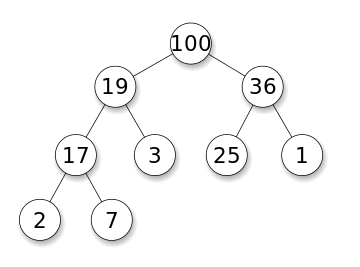

# Heap / Priority queue

## Binary heap

Binary max-heap is a binary tree where **the value of each node is at least the values of its children** (heap property)


## Complete binary tree

binary tree iss complete of all its levels are filled except possibly the last one which is **filled from left to right**

## Advantanges of using complete binary tree in heap

- Height of complete binary tree is O(logn)
- Can use array to store elements and parent-children relationship can be computed on the fly
  - parent(i) = i / 2
  - left_child(i) = i \* 2
  - right_child(i) = i \* 2 + 1
- To maintain the "complete" of a binary heap:
  - New element is inserted into the left-most empty leaf when insertion
  - Replace the right-most non-empty leaf with the root when extract_max

## Advantages of heap

    * Fast : All operations work in time O(logn)
    * Space effiecient: Can store an anrray of priority
    * Easy to implement

## In-place heap sort

### Build heap

```
size = n
for i = n/2 downto 1
	SiftDown(i)
```

Explain:

- Repair the heap property going from bottom to top
- Initialy, the heap property is satisfied all the leaves (half of the nodes are leaves)
- Start repairing the heap untill it reaches the root
  Time complexity: O(n) [prove](https://www.youtube.com/watch?v=MiyLo8adrWw&ab_channel=AlgorithmswithAttitude)

### Complexity

- Time complexity: O(nlogn) (Sorting takes n-1 times)
- Space complexity: O(1)

## References

- [https://www.youtube.com/watch?list=PLFDnELG9dpVxQCxuD-9BSy2E7BWY3t5Sm&t=3291&v=odNJmw5TOEE&feature=youtu.be&ab_channel=Coderisland](https://www.youtube.com/watch?list=PLFDnELG9dpVxQCxuD-9BSy2E7BWY3t5Sm&t=3291&v=odNJmw5TOEE&feature=youtu.be&ab_channel=Coderisland)
- [https://www.coursera.org/learn/data-structures/lecture/2OpTs/introduction](https://www.coursera.org/learn/data-structures/lecture/2OpTs/introduction)
